<div align="center">



<br/>

### `// YOUR ENTIRE SEMESTER. ONE BRUTAL HUB.`

Syllabi, past papers, lab practicals, and community notes for the **Shoolini ByteXL Batch 2025–29** — slammed into one loud, blocky, no-blur portal.

<br/>


<br/>

[](https://github.com/mprshark/SemesterHub)
[](https://github.com/mprshark/SemesterHub/issues/new)
[](#contributing)

</div>

---

> [!NOTE]
> **Read me like a card stack.** Most sections below are collapsible — click any `▸ summary` to pop it open. Built so you only load the panic you actually need.

## Contents

- [What is this](#what-is-this)
- [Features](#features)
- [Tech stack](#tech-stack)
- [Architecture](#architecture)
- [Database](#database)
- [Quick start](#quick-start)
- [Design system](#design-system)
- [Roadmap](#roadmap)
- [Contributing](#contributing)
- [License](#license)

---

## What is this

**SemesterHub** is a single front door for everything a course throws at you. No logins, no friction — open the site, find your subject, grab what you need, and yell into the **Panic Chat** at 2 AM with everyone else who's also cramming.

<details>
<summary><b>▸ The full pitch (click)</b></summary>

<br/>

University resources are scattered across WhatsApp forwards, dead Google Drive links, and that one senior who "has the papers." SemesterHub centralizes the chaos:

- **Curated core** — official syllabi, question papers, and lab practicals, hosted on a CDN.
- **Community layer** — anyone can upload class notes; everyone benefits instantly.
- **Live by default** — the Panic Chat updates in real time over WebSockets. No refresh, no accounts.
- **Loud on purpose** — a Neobrutalist UI that's impossible to confuse with a boring LMS.

Built for the **Shoolini University ByteXL Batch 2025–29**, currently covering **Python, DBMS, Algorithms, and Git**.

</details>

---

## Features

| | Feature | What it does |
|:--:|:--|:--|
| 📚 | **Subject Hub** | A responsive grid of subject cards → drill into any course for its full breakdown. |
| 🔎 | **Instant Search** | Real-time, client-side filter across every subject. Type, see, done. |
| 🗂️ | **Resource Tabs** | Syllabus · Notes · Past Papers · Lab/Practicals · Projects · Cheat Sheets · Books — all in one switcher. |
| 📤 | **Community Uploads** | Drop a PDF / DOCX / image straight from the browser. No auth wall. |
| 💬 | **Panic Chat** | A floating, anonymous, real-time chat mounted on every page. Powered by Supabase Realtime. |
| 🎞️ | **Infinite Ticker** | An always-scrolling marquee of subjects, because static is boring. |
| 📱 | **Fully Fluid** | Scales cleanly to mobile via CSS `clamp()`. No breakpoint babysitting. |
| 🧱 | **Neobrutalist UI** | Thick ink borders, hard offset shadows, zero blur, zero apology. |

---

## Tech stack

<details open>
<summary><b>▸ The whole machine</b></summary>

<br/>

| Layer | Choice | Why |
|:--|:--|:--|
| **Framework** | Next.js 15 (App Router, React 18+) | File-based routing, dynamic `[id]` subject pages, client components. |
| **Styling** | Vanilla CSS + CSS variables | One `globals.css` source of truth. **No Tailwind, on purpose.** |
| **Database** | Supabase (PostgreSQL) | Managed Postgres with Row Level Security. |
| **Realtime** | Supabase Realtime (WebSockets) | Live Panic Chat via `postgres_changes`. |
| **Storage** | Supabase Storage (CDN) | Public buckets serve files directly — no signed URLs. |
| **Client** | `@supabase/supabase-js` | Imported into client components for reads, inserts, and uploads. |

</details>

---

## Architecture

<details>
<summary><b>▸ Where everything lives</b></summary>

<br/>

```
resource-hub/
├── .env.local                 # Supabase URL + Anon Key (secrets)
├── next.config.ts             # Next.js config
├── package.json               # next · react · @supabase/supabase-js
├── public/
│   └── logo.png               # SemesterHub logo
│
└── src/
    ├── app/
    │   ├── globals.css         # 🧱 The Neobrutalist design system (vars, animations, clamp)
    │   ├── layout.tsx          # Root layout — fonts + globally mounts <ChatBox/>
    │   ├── page.tsx            # 🏠 Homepage — search bar + subject card grid
    │   └── subject/
    │       └── [id]/
    │           └── page.tsx    # 🔗 Dynamic subject route → renders <ResourceTabs/>
    │
    ├── components/
    │   ├── ChatBox.tsx         # 💬 Panic Chat — Supabase Realtime subscriber
    │   ├── Loader.tsx          # ⏳ "CRAMMING ENTIRE SYLLABUS..." splash
    │   └── Tabs.tsx            # 🗂️ Resource tabs + community upload logic
    │
    ├── data/
    │   └── syllabus.ts         # 📦 Static data layer — hardcoded subject schemas + CDN links
    │
    └── lib/
        └── supabase.ts         # 🔌 Initializes & exports the supabase-js client
```

**Data flow in one breath:** `page.tsx` lists subjects → `[id]/page.tsx` reads the hardcoded subject from `syllabus.ts` → `Tabs.tsx` fetches/uploads community notes via `supabase.ts` → `ChatBox.tsx` streams messages live. Styling is global semantic variables (`var(--saffron)`) applied via inline `style={{}}`.

</details>

---

## Database

Two tables, two storage buckets, RLS on everything. Anonymous read + insert — **no updates, no deletes** from the client.

<details>
<summary><b>▸ <code>messages</code> — the Panic Chat table</b></summary>

<br/>

```sql
create table messages (
  id         bigint primary key generated always as identity,
  content    text not null,
  created_at timestamp with time zone default timezone('utc'::text, now()) not null
);

alter table messages enable row level security;

create policy "Anyone can read messages" on messages for select to anon using (true);
create policy "Anyone can send messages" on messages for insert to anon with check (true);

-- Critical: lets the chat update instantly, no refresh
alter publication supabase_realtime add table messages;
```

</details>

<details>
<summary><b>▸ <code>community_notes</code> — the uploads table</b></summary>

<br/>

```sql
create table community_notes (
  id         bigint primary key generated always as identity,
  subject_id text not null,          -- maps to syllabusData IDs, e.g. "csu1162"
  file_name  text not null,
  file_url   text not null,          -- public Supabase storage URL
  created_at timestamp with time zone default timezone('utc'::text, now()) not null
);

alter table community_notes enable row level security;

create policy "Anyone can read notes"   on community_notes for select to anon using (true);
create policy "Anyone can upload notes" on community_notes for insert to anon with check (true);
```

</details>

<details>
<summary><b>▸ Storage buckets</b></summary>

<br/>

| Bucket | Type | Purpose | Policies |
|:--|:--|:--|:--|
| `resources` | Public | Official, heavy assets — syllabi & past papers from the instructor. | `SELECT` for all. **No** frontend `INSERT`. |
| `community-notes` | Public | Student uploads (PDF / DOCX / images). | `SELECT` + `INSERT` for `anon` so the uploader works without auth. |

> Both buckets are **Public** so the Next.js frontend serves files directly — no signed URLs.

</details>

---

## Quick start

```bash
# 1 — clone it
git clone https://github.com/mprshark/SemesterHub.git
cd SemesterHub

# 2 — install
npm install

# 3 — add your Supabase keys (see below), then:
npm run dev
```

Open **http://localhost:3000** and start cramming.

<details>
<summary><b>▸ Environment & Supabase setup</b></summary>

<br/>

Create a `.env.local` in the project root:

```bash
NEXT_PUBLIC_SUPABASE_URL=https://your-project.supabase.co
NEXT_PUBLIC_SUPABASE_ANON_KEY=your-anon-key
```

Then, in your Supabase project:

1. Run the SQL from the [Database](#database) section to create both tables + RLS policies.
2. Create two **public** storage buckets: `resources` and `community-notes`.
3. Add an `INSERT` policy for the `anon` role on `community-notes` so uploads work.
4. Enable Realtime on `messages` (the `alter publication` line does this).

</details>

<details>
<summary><b>▸ Deploy</b></summary>

<br/>

Next.js + Supabase deploys cleanly to **Vercel**, **Netlify**, or **Cloudflare Pages**. Push to your Git host, import the repo, add the two `NEXT_PUBLIC_*` env vars, ship. Preview deploys on every PR come free.

</details>

---

## Design system

The whole look is three colors, thick borders, and shadows that **never blur**. Single source of truth: `src/app/globals.css`.

<div align="center">

| Token | Hex | Swatch |
|:--|:--|:--|
| `--saffron` | `#FF9F1C` |  |
| `--ink` | `#1A1410` |  |
| `--paper` | `#FDF3E3` |  |

</div>

> The exact hex values may differ slightly in your `globals.css` — these are the banner's palette. Swap them to match your variables for a 1:1 look.

**The rules:**
- Borders → `3px solid var(--ink)`
- Shadows → `6px 6px 0 var(--ink)` &nbsp;*(hard, no blur)*
- Type → uppercase, monospace, blocky
- Motion → ticker scroll + neobrutalist "press" on hover
- Layout → fully fluid via `clamp()`

---

## Roadmap

- [x] Subject hub + dynamic subject pages
- [x] Real-time Panic Chat
- [x] Anonymous community uploads
- [x] Instant client-side search
- [ ] Upvotes / sort on community notes
- [ ] Basic spam guard on uploads & chat
- [ ] Dark mode (a *darker* paper, still brutal)
- [ ] More subjects + future batches

> Got an idea? [Open an issue.](https://github.com/mprshark/SemesterHub/issues/new)

---

## Contributing

Pull requests are welcome — and so are your **notes**. Two ways to help:

**Add notes (no code):** open the relevant subject → **Notes** tab → upload your PDF/DOCX/image. It's live for everyone immediately.

**Ship code:**

```bash
git checkout -b feature/your-thing
git commit -m "feat: your thing"
git push origin feature/your-thing
```

Then open a PR. Keep it Neobrutalist — thick borders, hard shadows, zero blur, sentence-case copy.

---

## License

Distributed under the **MIT License** — do basically anything, just keep the copyright notice. Drop a `LICENSE` file in the root if you haven't yet.

<div align="center">

<br/>

`CRAMMING ENTIRE SYLLABUS...`

**Built with caffeine, panic, and hard drop shadows.**

<sub>SemesterHub · Shoolini ByteXL 2025–29</sub>

</div>
